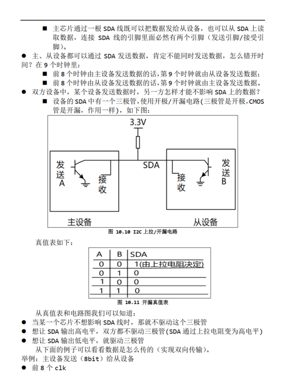
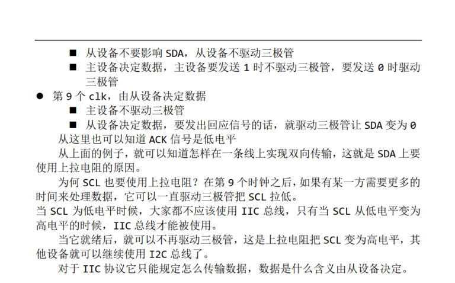

<!--
 * @Author: lion
 * @Date: 2025-09-19 16:19:30
 * @LastEditors: Chen Yiran 1060874648@qq.com
 * @LastEditTime: 2025-09-19 16:38:31
 * @FilePath: \linux-study\README.md
 * @Description: 
 * 
-->
# linux-study

## 🗓️ 按日期索引
- [Linux网络编程](#网络编程-2025-09-19)
- [Linux多线程](#多线程编程-2025-09-20)
- [Linux串口](#串口编程-2025-09-21)
- [LinuxI2C](#I2C编程-2025-09-24)

## 网络编程-2025-09-19
1. 客户端和服务端   
    1. **客户端**：
            在网络程序中，如果一个程序主动和外面的程序通信，那么我们把这个程序称为客户端程序。 比如我们使用ftp程序从另外一
            个地方获取文件的时候，是我们的ftp程序主动同外面进行通信（获取文件）， 所以这个地方我们的ftp程序就是客户端程序。

    2. **服务端**：
            和客户端相对应的程序即为服务端程序。被动的等待外面的程序来和自己通讯的程序称为服务端程序。
            比如上面的文件获取中，另外一个地方的程序就是服务端，我们从服务端获取文件过来。

2. TCP/UDP   
    1. **TCP(Transfer Control Protocol)** 传输控制协议是一种面向连接的协议, 当我们的网络程序使用这个协议的时候,网络可以保证我们的客户端和服务端的连接是 **可靠的,安全** 的.      

    2. **UDP(User Datagram Protocol)** 用户数据报协议是一种非面向连接的协议,这种协议并 **不能保证我们的网络程序的连接是可靠的(在视频传输情景下可能使用udp，可以存在一定的失误，但是效率较高保证传输流畅)** ,所以我们现在编写的程序一般是采用TCP协议的.

3. ip和端口：一台电脑的多个程序可以是同一个ip，但是端口会不同，以此来表示不同的请求，所以ip和端口共同来表示源或目的

4. 解释tcp服务器端和客户端的流程：
   1. 服务器：fd = socket()创建一个基本端点   bind()绑定自己的ip和端口信息(把fd和ip端口绑定)  listen()开始检测数据  accept()建立一条连接 send()/recv()数据收发
   2. 客户端：fd = socket()创建一个基本端点  connect()连接服务器的ip和端口 send()/recv()数据收发

5. 在tcp服务器端实现代码中，为了实现多个客户端连接，在accept到一个请求后就会使用fork()创建一个子进程来处理这个请求，父进程继续回到accept()等待下一个请求。
```
#include <sys/types.h>          /* See NOTES */
#include <sys/socket.h>
#include <string.h>
#include <sys/socket.h>
#include <netinet/in.h>
#include <arpa/inet.h>
#include <unistd.h>
#include <stdio.h>
#include <signal.h>
/* socket
* bind
  * listensocket()
  * accept
  * send/recv
    */

#define SERVER_PORT 8888
#define BACKLOG     10

int main(int argc, char **argv)
{
    int iSocketServer;
    int iSocketClient;
    struct sockaddr_in tSocketServerAddr;
    struct sockaddr_in tSocketClientAddr;
    int iRet;
    int iAddrLen;
    
    int iRecvLen;
    unsigned char ucRecvBuf[1000];
    
    int iClientNum = -1;
    
    /*防止僵死进程*/
    signal(SIGCHLD,SIG_IGN);
    
    iSocketServer = socket(AF_INET, SOCK_STREAM, 0);
    if (-1 == iSocketServer)
    {
        printf("socket error!\n");
        return -1;
    }
    
    tSocketServerAddr.sin_family      = AF_INET;
    tSocketServerAddr.sin_port        = htons(SERVER_PORT);  /* host to net, short */
    tSocketServerAddr.sin_addr.s_addr = INADDR_ANY;
    memset(tSocketServerAddr.sin_zero, 0, 8);
    
    iRet = bind(iSocketServer, (const struct sockaddr *)&tSocketServerAddr, sizeof(struct sockaddr));
    if (-1 == iRet)
    {
        printf("bind error!\n");
        return -1;
    }
    
    iRet = listen(iSocketServer, BACKLOG);
    if (-1 == iRet)
    {
        printf("listen error!\n");
        return -1;
    }
    
    while (1)
    {
        iAddrLen = sizeof(struct sockaddr);
        iSocketClient = accept(iSocketServer, (struct sockaddr *)&tSocketClientAddr, &iAddrLen);
        if (-1 != iSocketClient)
        {
            iClientNum++;
            printf("Get connect from client %d : %s\n",  iClientNum, inet_ntoa(tSocketClientAddr.sin_addr));
            /*fork()创建子进程处理这个客户端的请求*/
            if (!fork())
            {
                /*子进程代码*/
                while (1)
                {
                    
                    iRecvLen = recv(iSocketClient, ucRecvBuf, 999, 0);
                    if (iRecvLen <= 0)
                    {
                        close(iSocketClient);
                        return -1;
                    }
                    else
                    {
                        ucRecvBuf[iRecvLen] = '\0';
                        printf("Get Msg From Client %d: %s\n", iClientNum, ucRecvBuf);
                    }
                }				
            }
            /*父进程运行位置*/
        }
    }
    
    close(iSocketServer);
    return 0;
}
```

6. tcp客户端实现代码 
```
#include <sys/types.h>          /* See NOTES */
#include <sys/socket.h>
#include <string.h>
#include <sys/socket.h>
#include <netinet/in.h>
#include <arpa/inet.h>
#include <unistd.h>
#include <stdio.h>

/* socket
* connect
* send/recv
  */

#define SERVER_PORT 8888

int main(int argc, char **argv)
{
    int iSocketClient;
    struct sockaddr_in tSocketServerAddr;

	int iRet;
	unsigned char ucSendBuf[1000];
	int iSendLen;

	if (argc != 2)
	{
		printf("Usage:\n");
		printf("%s <server_ip>\n", argv[0]);
		return -1;
	}

	iSocketClient = socket(AF_INET, SOCK_STREAM, 0);

	tSocketServerAddr.sin_family      = AF_INET;
	tSocketServerAddr.sin_port        = htons(SERVER_PORT);  /* host to net, short */
 	//tSocketServerAddr.sin_addr.s_addr = INADDR_ANY;
 	if (0 == inet_aton(argv[1], &tSocketServerAddr.sin_addr))
 	{
		printf("invalid server_ip\n");
		return -1;
	}
	memset(tSocketServerAddr.sin_zero, 0, 8);


	iRet = connect(iSocketClient, (const struct sockaddr *)&tSocketServerAddr, sizeof(struct sockaddr));	
	if (-1 == iRet)
	{
		printf("connect error!\n");
		return -1;
	}

	while (1)
	{
		if (fgets(ucSendBuf, 999, stdin))
		{
			iSendLen = send(iSocketClient, ucSendBuf, strlen(ucSendBuf), 0);
			if (iSendLen <= 0)
			{
				close(iSocketClient);
				return -1;
			}
		}
	}
	
	return 0;
}
```
 
## 多线程编程-2025-09-20
1. 进程和线程
    1. 进程是操作系统分配资源的基本单位，每个进程拥有独立的内存空间和资源，进程之间相互隔离。线程是进程中的执行单元，同一进程内的多个线程共享进程的资源（如内存），但每个线程有自己的执行栈和寄存器。简单来说，进程像一个房子，线程是房子里的工人，工人可以一起工作并共享房子的设施，但不同房子的工人互不干扰。
    2. **进程之间传递信息占用资源大，效率低下，二线程之间(资源共享)传递信息占用空间小，效率高**
    3. 在linux中调度是以线程为单位的，资源的分配是以进程为单位的


2. 多线程的代码示例
    1. 最基本的程序   
    _warning_:在使用一个陌生函数的时候，查询man手册的时候，不仅要看函数需要包含的头文件，还需要看看是否需要链接其他库，默认库不需要在编译命令是时候链接，
    例如：在编译线程相关的代码的时候需要链接pthread库，所以编译命令是：gcc pthread_test.c -o pthread_test -lpthread，也可以gcc pthread_test.c -o pthread_test -pthread(更加推荐使用，自动添加一些编译选项（如宏定义)
    ```
    #include <pthread.h>
    #include <stdio.h>
    #include <unistd.h>


    static void *my_thread_func (void *data)
    {
        while (1)
        {
            sleep(1);
        }
    }


    int main(int argc, char **argv)
    {
        /*保存线程ID */
        pthread_t tid;
        int ret;
    
        /* 1. 创建"接收线程"  ID，属性(指定新栈的大小，调度策列，优先级)，运行函数，传入参顺 */
        ret = pthread_create(&tid, NULL, my_thread_func, NULL);
        if (ret)
        {
            printf("pthread_create err!\n");
            return -1;
        }


        /* 2. 主线程读取标准输入, 发给"接收线程" */
        while (1)
        {
            sleep(1);
        }
        return 0;
    }
    ```
    2. 使用信号量的示例
    ```
    #include <pthread.h>
    #include <stdio.h>
    #include <unistd.h>
    #include <semaphore.h>

    static char g_buf[1000];
    static sem_t g_sem;
    static void *my_thread_func (void *data)
    {
        while (1)
        {
            //sleep(1);
            /* 等待通知 */
            //while (g_hasData == 0);
            /*只有信号量为0的时候阻塞，在sem_post增加1后，这个函数不阻塞，对信号量减1，然后继续执行后续代码，再次到这个函数时，检查信号量是否为0*/
            sem_wait(&g_sem);

            /* 打印 */
            printf("recv: %s\n", g_buf);
        }
        return NULL;
    }


    int main(int argc, char **argv)
    {
        pthread_t tid;
        int ret;

        sem_init(&g_sem, 0, 0);
    
        /* 1. 创建"接收线程" */
        ret = pthread_create(&tid, NULL, my_thread_func, NULL);
        if (ret)
        {
            printf("pthread_create err!\n");
            return -1;
        }


        /* 2. 主线程读取标准输入, 发给"接收线程" */
        while (1)
        {
            fgets(g_buf, 1000, stdin);

            /* 通知接收线程 */
            sem_post(&g_sem);
        }
        return 0;
    }
    ```
    3. 使用互斥锁的示例
    ```
    #include <pthread.h>
    #include <stdio.h>
    #include <unistd.h>
    #include <semaphore.h>
    #include <string.h>

    static char g_buf[1000];
    static sem_t g_sem;
    static pthread_mutex_t g_tMutex  = PTHREAD_MUTEX_INITIALIZER;

    static void *my_thread_func (void *data)
    {
    while (1)
    {
            //sleep(1);
            /* 等待通知 */
            //while (g_hasData == 0);
            sem_wait(&g_sem);

            /* 打印 使用互斥锁避免在打印或者写入的时候同时对同一个缓冲区操作*/
            pthread_mutex_lock(&g_tMutex);
            printf("recv: %s\n", g_buf);
            pthread_mutex_unlock(&g_tMutex);
        }

        return NULL;
    }


    int main(int argc, char **argv)
    {
        pthread_t tid;
        int ret;
        char buf[1000];

        sem_init(&g_sem, 0, 0);
    
        /* 1. 创建"接收线程" */
        ret = pthread_create(&tid, NULL, my_thread_func, NULL);
        if (ret)
        {
            printf("pthread_create err!\n");
            return -1;
        }


        /* 2. 主线程读取标准输入, 发给"接收线程" */
        while (1)
        {
            fgets(buf, 1000, stdin);
            pthread_mutex_lock(&g_tMutex);
            memcpy(g_buf, buf, 1000);
            pthread_mutex_unlock(&g_tMutex);

            /* 通知接收线程 */
            sem_post(&g_sem);
        }
        return 0;
    }
   ```
    4. 条件成立变量
    ```
    #include <pthread.h>
    #include <stdio.h>
    #include <unistd.h>
    #include <semaphore.h>
    #include <string.h>
    
    static char g_buf[1000];
    static pthread_mutex_t g_tMutex  = PTHREAD_MUTEX_INITIALIZER;
    static pthread_cond_t  g_tConVar = PTHREAD_COND_INITIALIZER;
    
    static void *my_thread_func (void *data)
    {
        while (1)
        {
            //sleep(1);
            /* 等待通知 */
            //while (g_hasData == 0);
            pthread_mutex_lock(&g_tMutex);
            /*条件成立就获得互斥量继续执行下去，条件不成立就释放互斥量继续等待*/
            pthread_cond_wait(&g_tConVar, &g_tMutex);
    
            /* 打印 */
            printf("recv: %s\n", g_buf);
            pthread_mutex_unlock(&g_tMutex);
        }
    
        return NULL;
    }
    
    
    int main(int argc, char **argv)
    {
        pthread_t tid;
        int ret;
        char buf[1000];
    
        /* 1. 创建"接收线程" */
        ret = pthread_create(&tid, NULL, my_thread_func, NULL);
        if (ret)
        {
            printf("pthread_create err!\n");
            return -1;
        }
    
    
        /* 2. 主线程读取标准输入, 发给"接收线程" */
        while (1)
        {
            fgets(buf, 1000, stdin);
            pthread_mutex_lock(&g_tMutex);
            memcpy(g_buf, buf, 1000);
            pthread_cond_signal(&g_tConVar); /* 通知接收线程 */
            pthread_mutex_unlock(&g_tMutex);
        }
        return 0;
    }
    
    ```

## 串口编程-2025-09-21
1. 基本信息
   1. 波特率，停止位，校验位
   2. 一般的ram板子用的是**ttl电平串口通信**(不适合长距离传输)  
   3. 电脑用的是**rs232电平串口通信**(适合长距离传输)
2. TTY设备
   1. 从tty1开始即为虚拟终端，**tty0为前台终端(即当前终端所在的终端)**，想要其他虚拟终端发送的消息我们始终可见，可以将信息发送给tty0，这样无论切换任意虚拟终端都可接收到该信息
   2. 而 **/dev/tty则表示当前程序所使用的tty设备**
      3. console(控制台)
         1. 权限更大
         2. 可以指定某个tty设备作为控制台 
3. 串口程序
   1. open->设置行规程（波特率，数据位，停止位等等或者的raw模式（返回原始数据））->read/write
   2. 程序接收发送关键函数及其注释：
   ```
   //打开端口
   fd = open_port(argv[1]);
   //设置行规程
   iRet = set_opt(fd, 115200, 8, 'N', 1);
   /*其中设置行规程内部函数需要设置以下程序*/
   newtio.c_cc[VMIN]  = 1;  /* 读数据时的最小字节数: 没读到这些数据我就不返回! */
   newtio.c_cc[VTIME] = 0; /* 等待第1个数据的时间:
   * 比如VMIN设为10表示至少读到10个数据才返回,
   * 但是没有数据总不能一直等吧? 可以设置VTIME(单位是10秒)
   * 假设VTIME=1，表示:
   *    10秒内一个数据都没有的话就返回
   *    如果10秒内至少读到了1个字节，那就继续等待，完全读到VMIN个数据再返回
   */
   //读写数据
   iRet = write(fd, &c, 1);
   iRet = read(fd, &c, 1);
   ```
   
## I2C编程-2025-09-24
1. I2C框架（在驱动大全部分会进一步更新）
   App->I2C驱动（又分为两层--devicelayer（如何读写数据--比如获取某种传感器数据需要读取对应哪种id的数据）和controllayer--底层发送接收逻辑）
2. I2C协议介绍--对于常见的通信协议还需要重新出一个汇总介绍详细通信过程以及如何查看波形这里只是暂时回顾i2c
   1. I2C读操作：！[I2C读操作](./i2c/i2c_read.png)
   2. I2C写操作：！[I2C写操作](./i2c/i2c_write.png)
   3. I2C实际通信波形：！[I2C实际通信波形](./i2c/i2c_wave.png)
      发送的第一个字节，前八位是地址，第八位是读或写，后续为正常读写数据
      高低电平在SCL为高电平期间读取SDA电平，SCL为低电平期间改变SDA电平
   4. 硬件设计：
               
         
            
         


